# Silver entity relationships

Logical keys inferred from column names and the synthetic dataset contract (`synthetic_data/README.md`). Silver tables do not declare PostgreSQL PK/FK constraints in catalog metadata; treat these as **integration contracts** for gold modeling.

## Hub: customer

`dh_customer.customer_id` is the primary business key. The following tables reference `customer_id`:

| Table | Role |
|-------|------|
| `dh_party`, `dh_contact`, `dh_account_hierarchy` | Identity extensions |
| `dh_household` | Links via `primary_customer_id` |
| `dh_plan`, `dh_package`, `dh_contract`, `dh_installed_asset`, `dh_sim_esim` | Product / subscription |
| `dh_cdr`, `dh_ip_data`, `dh_bandwidth_usage`, `dh_qoe_metrics` | Usage & QoE |
| `dh_invoice`, `dh_payment`, `dh_ar_accounts_receivable`, `dh_balance`, `dh_dunning` | Billing |
| `dh_ticket`, `dh_case`, `dh_ivr_log`, `dh_store_visit`, `dh_dispatch` | Care & field |
| `dh_churn_score`, `dh_clv`, `dh_propensity_to_buy`, `dh_sentiment`, `dh_next_best_action` | Scores & recommendations |

## Invoice lifecycle

`invoice_id` ties billing events:

```
dh_invoice ── invoice_id ──► dh_payment
                          ├── dh_ar_accounts_receivable
                          └── dh_dunning
```

## Network geography

```
dh_tower.tower_id ◄── tower_id ── dh_cdr
                              └── dh_qoe_metrics
```

## Sentiment on interactions

`dh_sentiment.interaction_id` → `dh_ticket.ticket_id` (per synthetic data README).

## Account hierarchy (self-referential)

`dh_account_hierarchy.parent_account_id` → `dh_account_hierarchy.account_id` (rollup trees by `account_type`, `hierarchy_level`).

## Household

`dh_household.primary_customer_id` → `dh_customer.customer_id` (household-level demographics and income band).

```mermaid
erDiagram
    dh_customer ||--o{ dh_party : customer_id
    dh_customer ||--o{ dh_contact : customer_id
    dh_customer ||--o{ dh_account_hierarchy : customer_id
    dh_customer ||--o| dh_household : primary_customer_id
    dh_customer ||--o{ dh_plan : customer_id
    dh_customer ||--o{ dh_package : customer_id
    dh_customer ||--o{ dh_contract : customer_id
    dh_customer ||--o{ dh_installed_asset : customer_id
    dh_customer ||--o{ dh_sim_esim : customer_id
    dh_customer ||--o{ dh_cdr : customer_id
    dh_customer ||--o{ dh_ip_data : customer_id
    dh_customer ||--o{ dh_bandwidth_usage : customer_id
    dh_customer ||--o{ dh_qoe_metrics : customer_id
    dh_customer ||--o{ dh_invoice : customer_id
    dh_customer ||--o{ dh_payment : customer_id
    dh_customer ||--o{ dh_ar_accounts_receivable : customer_id
    dh_customer ||--o{ dh_balance : customer_id
    dh_customer ||--o{ dh_dunning : customer_id
    dh_customer ||--o{ dh_ticket : customer_id
    dh_customer ||--o{ dh_case : customer_id
    dh_customer ||--o{ dh_ivr_log : customer_id
    dh_customer ||--o{ dh_store_visit : customer_id
    dh_customer ||--o{ dh_dispatch : customer_id
    dh_customer ||--o| dh_churn_score : customer_id
    dh_customer ||--o| dh_clv : customer_id
    dh_customer ||--o{ dh_propensity_to_buy : customer_id
    dh_customer ||--o{ dh_sentiment : customer_id
    dh_customer ||--o{ dh_next_best_action : customer_id
    dh_invoice ||--o{ dh_payment : invoice_id
    dh_invoice ||--o{ dh_ar_accounts_receivable : invoice_id
    dh_invoice ||--o{ dh_dunning : invoice_id
    dh_tower ||--o{ dh_cdr : tower_id
    dh_tower ||--o{ dh_qoe_metrics : tower_id
    dh_ticket ||--o{ dh_sentiment : ticket_id
```



## Conformed dimensions (recommended)

When building gold, conflate attributes once and reuse:

- **Customer** — `dh_customer` + latest `dh_churn_score`, `dh_clv`, household income band
- **Geography** — customer `city`/`state`/`country`; tower `region`; store visits by `store_id`
- **Product** — plan, package, contract, SIM, installed asset
- **Time** — invoice_date, payment_date, usage_date, call_start_ts, score_date, etc.
- **Channel** — ticket `channel`, IVR, store visit, case type
