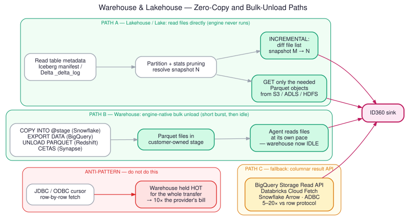
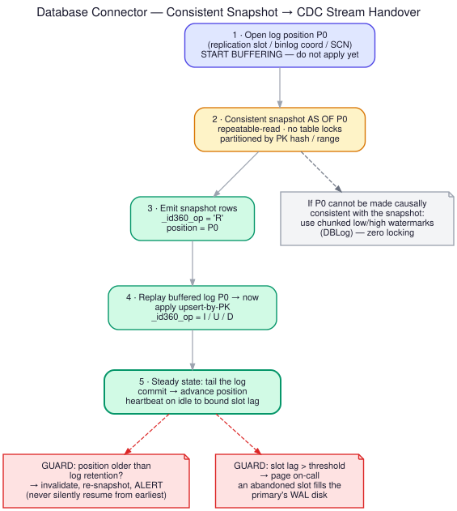
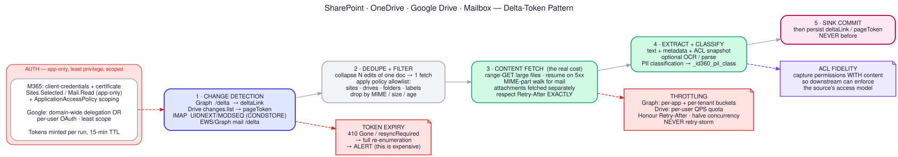

# Source Families — Approaches and Trade-offs

Eight source types, mapped onto the five strategies. For each: how to read it, what breaks,
and what it costs the provider.

---

## 1. Data Lakehouse (Delta Lake, Apache Iceberg, Apache Hudi)



### Approach A — Direct metadata + file read (strongly preferred)

The table format's metadata *is* a public API. You do not need Databricks, you do not need
Snowflake, you do not need any compute from the provider.

```
Iceberg:  catalog → table metadata JSON → manifest list → manifests → data files
Delta:    _delta_log/*.json + *.checkpoint.parquet → add/remove actions → data files
Hudi:     .hoodie timeline → file slices
```

- **Incremental** = diff the file set between snapshot/version M and N. Iceberg exposes this
  natively (`incremental append scan`); Delta exposes it as Change Data Feed if the table has
  `delta.enableChangeDataFeed=true`, otherwise via `add`/`remove` actions in the log.
- **Pruning** = use partition values and per-file column statistics (min/max/null counts) in
  the manifest to skip files entirely before you fetch a byte.
- **Deletes** = Iceberg positional/equality delete files and Delta deletion vectors must be
  applied, or you will resurrect deleted rows. This is the single most common bug in
  hand-rolled lakehouse readers. If you skip merge-on-read handling, you are reading a
  *different table* than the engine sees.

**Cost to provider:** object-storage GETs only. No cluster, no credits. This is as cheap as
data movement gets.

**Access needed:** catalog read (Unity Catalog / Glue / Hive Metastore / Nessie / REST catalog)
plus read on the storage prefix. Notably, if the provider uses Unity Catalog or Lake Formation
with credential vending, you get scoped, short-lived storage credentials for free — use them.

### Approach B — SQL over the engine

Falls back to the warehouse pattern (below). Use only when the provider will not grant direct
storage access, or when the table has row/column security policies that only the engine
enforces. That second case matters: if governance is enforced at the engine layer, reading
files directly **bypasses the provider's security controls** — which is a compliance problem
even if it is technically possible. Ask; do not assume.

### Trade-offs

| | Direct file read | Via engine |
|---|---|---|
| Provider compute cost | Zero | Per-query credits |
| Governance enforcement | Bypassed (must replicate policy yourself) | Enforced by source |
| Merge-on-read correctness | You must implement it | Free |
| Schema evolution | You must map field-IDs correctly | Free |
| Time travel | Native | Native |

---

## 2. Data Lake (HDFS, S3, ADLS, GCS — raw files, no table format)

### Approach: listing + manifest-based incremental

The problem is not reading files, it is **knowing which files are new** without a full listing.
Full `LIST` on a bucket with tens of millions of objects is slow and, on S3, genuinely
expensive.

| Technique | Mechanism | When |
|---|---|---|
| **Partition-path pruning** | Layout is `dt=2026-07-20/hour=09/`. Compute the paths you need; never list the root. | The layout is date-partitioned (usually is) |
| **Event notification** | S3 Event Notifications → SQS; ADLS Event Grid; GCS Pub/Sub. The lake *tells you* what landed. | Provider will configure it — this is the best option |
| **Inventory reports** | S3 Inventory / ADLS Blob Inventory: a daily manifest of every object, delivered as Parquet. Diff yesterday's against today's. | Very large buckets, daily cadence acceptable |
| **Listing with a marker** | `list_objects_v2(StartAfter=last_key)` — lexicographic resume | Fallback; only viable if keys sort by time |
| **HDFS** | `inotify` edit-log stream via the NameNode, or `fs -ls` on partition paths | HDFS; avoid full-tree walks, they hammer the NameNode |

**Format handling.** Parquet/ORC/Avro: read column-projected and predicate-pushed, do not
deserialize whole rows. CSV/JSON: infer schema from a sample, pin it in the registry, then
parse with an explicit schema — never re-infer per run, it produces silent type flapping.
Compressed non-splittable files (gzip CSV) are a parallelism killer: one file = one task.

**Small-file problem.** A lake with a million 4 KB files costs far more in request overhead
than in bytes. Batch reads, and coalesce on write to the sink.

**Cost to provider:** LIST requests dominate. `LIST` is ~10× the cost of `GET` per request on
S3. Prune aggressively; prefer notifications.

---

## 3. Data Warehouse (Snowflake, BigQuery, Redshift, Synapse, Teradata)

### Approach A — Bulk unload to a stage (preferred)

```sql
-- Snowflake
COPY INTO @id360_stage/orders/run=<run_id>/
FROM (SELECT order_id, customer_id, amount, updated_at
        FROM sales.orders
       WHERE updated_at > :hwm AND updated_at <= :bound)
FILE_FORMAT = (TYPE = PARQUET COMPRESSION = SNAPPY)
HEADER = TRUE MAX_FILE_SIZE = 128000000;
```

The warehouse runs a short parallel job and then goes idle. You read the files on your own
schedule. **This is roughly an order of magnitude cheaper for the provider than an equivalent
JDBC cursor**, which pins a warehouse hot for the whole transfer.

Equivalents: BigQuery `EXPORT DATA`, Redshift `UNLOAD ... FORMAT PARQUET PARALLEL ON`,
Synapse CETAS, Teradata TPT/FastExport.

### Approach B — Columnar streaming API

BigQuery Storage Read API (free for many use cases and genuinely fast), Databricks Cloud Fetch,
Snowflake's Arrow result format, ADBC drivers. Use when a stage is unavailable. 5–20× better
throughput per unit of engine time than the ODBC row protocol.

### Approach C — Native change tracking

- **Snowflake Streams** — an offset on a table, gives you inserts/updates/deletes since last
  consumption. Combine with a task or a pull. Note: consuming a stream in a DML statement
  advances it; design carefully or you lose data on a failed run.
- **BigQuery** — `CHANGES` TVF / change history where enabled; otherwise partition-pruned
  incremental on ingestion time (`_PARTITIONTIME`), which is very cheap.
- **Redshift** — no native CDC; watermark only.

### Warehouse-specific cost rules

| Engine | Billing unit | The rule that matters |
|---|---|---|
| Snowflake | Warehouse-seconds (60 s minimum, per-second after) | Batch your queries. Ten small queries a minute apart cost ten minutes of warehouse. One query costs one. Use a dedicated XS warehouse with `AUTO_SUSPEND=60`. |
| BigQuery | Bytes scanned (on-demand) | Partition filter is mandatory, not optional. Always `SELECT` named columns — `SELECT *` on a wide table is a direct bill multiplier. Use `--dry_run` to price every query before running it. |
| Redshift | Cluster time / RPUs | Use a dedicated WLM queue with a concurrency and memory cap so you cannot starve their workload. |
| Synapse | DWUs / serverless bytes | Same as BigQuery for serverless; resource class caps for dedicated. |
| Teradata | Concurrency slots / AMP time | Run in a low-priority TASM workload. TPT export, not row fetch. |

**Always tag your queries.** `QUERY_TAG` (Snowflake), job labels (BigQuery), `query_group`
(Redshift). The provider must be able to run one report showing exactly what ID360 cost them.
Nothing buys goodwill like handing them that report before they ask.

---

## 4. Database (OLTP: Oracle, SQL Server, PostgreSQL, MySQL, Db2, MongoDB)



This is the source family where a careless connector does the most damage, because you are
reading from a system serving live user traffic.

### Rules of engagement

1. **Read from a replica.** Not the primary. Ask on day one. Almost every enterprise has a
   read replica, a standby, or a reporting mirror. If they say no, ask why, and ask again.
2. **Never hold long transactions.** A read transaction open for an hour on Postgres blocks
   vacuum and bloats the table. On Oracle it risks ORA-01555. Chunk the read.
3. **Statement timeout on every query.** No exceptions. And cancel server-side on the client
   timeout, or you leave orphaned queries burning CPU after your client has given up.
4. **Bounded concurrency, from a small dedicated pool.** Your connector should never be able
   to consume a meaningful fraction of `max_connections`.
5. **Low-priority resource group** where the engine supports it (Oracle Resource Manager,
   SQL Server Resource Governor).

### Strategy selection

**Log-based CDC (Strategy 3)** is the right answer when you can get it — near-zero load on the
query path, and it captures deletes. See [02-extraction-strategies.md](02-extraction-strategies.md#strategy-3--log-based-cdc)
for the snapshot→stream handover, which is the hard part.

The operational commitment is real and you should be honest about it up front: someone must
monitor replication-slot lag. An abandoned Postgres slot retains WAL until the primary's disk
fills, and then the provider's production database goes down. That is a career-limiting
incident and it is entirely preventable with one alert.

**Watermark (Strategy 2)** is the pragmatic default when CDC is refused. Composite
`(updated_at, pk)` watermark, bounded upper edge, indexed column, plus a weekly key-set diff
for deletes.

**Partitioned snapshot (Strategy 1)** for bootstrap and for small reference tables.

### Oracle specifics

LogMiner is free but expensive on the source; XStream/GoldenGate is cheap on the source but
licensed. If neither is available: `ORA_ROWSCN` (with `ROWDEPENDENCIES`, otherwise it is
block-level and too coarse), or Data Pump export to a directory object for bulk. Flashback
Query (`AS OF SCN`) gives you consistent partitioned snapshots without locking.

### SQL Server specifics

**Change Tracking** is much lighter than **CDC** — it records only "this key changed", not the
column values, so it costs the source far less. If your sink does upsert-by-PK anyway, Change
Tracking + a targeted re-read of changed keys is often the best cost/complexity trade. Use
`READ COMMITTED SNAPSHOT` or `WITH (NOLOCK)` — but understand that `NOLOCK` gives you dirty
reads and can double-count rows during page splits. Prefer RCSI.

### MongoDB specifics

Change streams with resume tokens. Watch for oplog rollover invalidating your token — same
handling as an expired CDC position: detect, alert, re-snapshot.

---

## 5. SharePoint · 6. OneDrive · 7. Google Drive



These three are one connector family with three auth backends. All support Strategy 4.

### Microsoft Graph (SharePoint + OneDrive)

```
Discovery:  /sites?search=  →  /sites/{id}/drives  →  /drives/{id}/root
Changes:    /drives/{id}/root/delta   →   @odata.deltaLink (persist after commit)
Content:    /drives/{id}/items/{itemId}/content   (range GETs for large files)
Metadata:   ?$select=id,name,size,file,lastModifiedDateTime,createdBy,parentReference
Perms:      /drives/{id}/items/{itemId}/permissions
```

**Auth — the important part.** Use app-only (client credentials) with a **certificate**, not a
client secret. Then scope it:

- `Sites.Selected` instead of `Sites.Read.All` — the permission is granted per-site, so a
  compromised app cannot read the whole tenant. This is the single highest-value security
  control in the M365 connectors and most implementations skip it.
- Never `Files.Read.All` on a tenant unless the contract genuinely requires it.

**Throttling.** Graph enforces per-app *and* per-tenant limits and returns `429` with
`Retry-After`. Honour the header exactly — do not use your own backoff curve, and do not
retry-storm. Sustained violation gets your app throttled tenant-wide, which affects the
provider's other applications. Use `$batch` (up to 20 sub-requests) to cut round-trips, and
`$select` to avoid fetching fields you discard.

**Large files.** Range-GET in chunks with resume. A 2 GB download that fails at 90% and
restarts from zero is both a cost and a reliability problem.

### Google Drive

```
Changes:  changes.getStartPageToken  →  changes.list(pageToken=..., includeItemsFromAllDrives=true)
Content:  files.get(fileId, alt=media)
Native:   files.export(fileId, mimeType=...)   ← Docs/Sheets/Slides must be exported
Perms:    permissions.list(fileId)
```

**Auth.** Service account with domain-wide delegation gives you tenant-wide reach — powerful
and correspondingly dangerous. Prefer per-user OAuth or a shared-drive-scoped service account
where the contract allows. Always request the narrowest scope: `drive.readonly`, or better,
`drive.file` if the access pattern permits.

**Quotas** are per-user and per-project QPS. Exponential backoff with jitter on `403
rateLimitExceeded` and `429`. Use `fields=` projection on every call — the default response is
much larger than you need.

**Native Google formats have no bytes.** A Google Doc must be exported to a concrete MIME type,
and export has its own (lower) size limits. Handle the failure explicitly rather than silently
dropping the document.

### Shared concerns across all three

**Capture ACLs with the content.** If you ingest a document but not its permissions, every
downstream consumer of your tool inherits a permissions bug. Snapshot the permission set
alongside the content, version it, and let downstream enforce the source's access model.
This is not optional for enterprise deployments — it is the difference between a data platform
and a data leak.

**Dedupe before fetching.** A file edited 40 times in an hour appears 40 times in the change
feed. Collapse to the latest version per item per run.

**Filter early.** Apply the policy allowlist (sites, drives, folders, MIME types, size caps,
age cutoffs) *before* the content fetch. Fetching then discarding wastes the provider's quota
and puts data you were never supposed to hold into your process memory.

---

## 8. Mailbox (Exchange Online / Graph, IMAP, Gmail)

Highest-sensitivity source in the list. Treat accordingly.

| Backend | Change detection | Notes |
|---|---|---|
| Graph (Exchange Online) | `/users/{id}/mailFolders/{f}/messages/delta` | App-only + **ApplicationAccessPolicy** to restrict which mailboxes the app can touch. Without that policy, `Mail.Read` = every mailbox in the tenant. |
| Gmail API | `users.history.list(startHistoryId=...)` | Watch history-ID expiry (~7 days) → full re-sync |
| IMAP | `UIDNEXT` + `UIDVALIDITY`; `CONDSTORE`/`QRESYNC` for `MODSEQ` | `UIDVALIDITY` change means the folder was recreated — all UIDs are invalid, re-sync that folder |
| EWS | `SyncFolderItems` with a sync state | Legacy; being retired — do not build new on it |

### Technique notes

- **Fetch headers first, bodies on demand.** Most policies only need envelope metadata. Pulling
  every body plus every attachment multiplies volume by 10–50× and multiplies your risk by more
  than that.
- **MIME walk, do not regex.** Use a real MIME parser. Handle nested multipart, TNEF
  (`winmail.dat`), inline vs attached, and character-set mislabelling.
- **Attachments are separate objects.** Store them by content hash, dedupe aggressively — the
  same 8 MB deck attached across a 200-person thread should be stored once.
- **IMAP: batch and pipeline.** One `FETCH` per message is pathological on a large folder. Use
  UID ranges and request only the parts you need (`BODY.PEEK[HEADER]` — `PEEK` so you do not
  mark the user's mail as read, which is an embarrassing and very visible bug).
- **Journaling is the enterprise-grade path.** For compliance-driven ingestion, ask whether the
  provider already runs a journaling rule or an eDiscovery export. Consuming an existing
  journal feed costs the mail platform nothing extra and is far more defensible than crawling
  live mailboxes.

### Governance

Mail almost always contains personal data. Encrypt at the field level for sender/recipient/
subject if the contract requires it. Retention and legal-hold rules from the source may need to
be *mirrored* into your sink — check before ingesting, because deleting from your sink later is
much harder than not ingesting in the first place. Minimize by default: folders on an
allowlist, date range bounded, attachment types filtered.

---

## Summary matrix

| Source | Primary strategy | Fallback | Provider cost driver | Biggest risk |
|---|---|---|---|---|
| Lakehouse | 5a direct file read | 5b engine unload | Object GETs | Missing merge-on-read deletes; bypassing engine governance |
| Data lake | 4 event notifications | 5a + partition pruning | LIST requests | Full-bucket listing; small files |
| Warehouse | 5b bulk unload | 5c Arrow API | Compute credits / bytes scanned | Row-cursor extraction pinning a warehouse |
| Database | 3 log CDC | 2 watermark + key diff | IOPS, connections | Replication slot filling the primary's disk |
| SharePoint | 4 Graph delta | full enumeration | API throttling budget | Over-broad `Sites.Read.All`; losing ACLs |
| OneDrive | 4 Graph delta | full enumeration | API throttling budget | Same |
| Google Drive | 4 changes.list | full enumeration | Per-user QPS quota | Domain-wide delegation over-reach |
| Mailbox | 4 delta / history | IMAP UID scan | API + mailbox IOPS | Mailbox-wide app permission; body/attachment volume |
