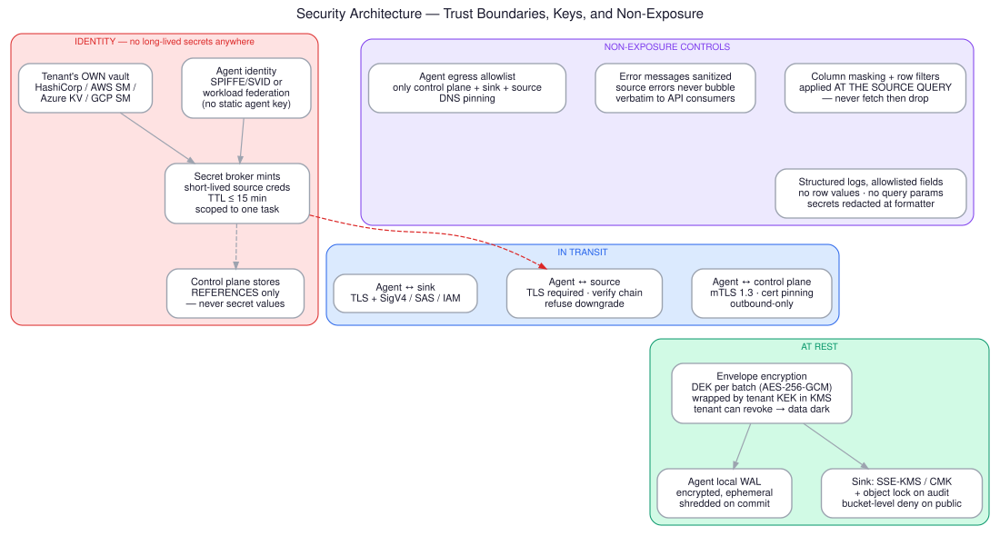

# Security Architecture



The project constraints are: enterprise-grade, encrypted at rest and in transit, must not
expose or leak data, must be auditable, must be traceable. This document is how each of those
is actually enforced rather than asserted.

---

## 1. Identity — no long-lived secrets, anywhere

### Agent identity

The agent authenticates to the control plane with a **workload identity**, not a shared key.

- Kubernetes: SPIFFE/SPIRE SVID, or the cluster's projected service-account token federated
  to your IdP.
- VM/bare metal: hardware-attested identity (TPM) or a short-lived certificate from an
  internal CA, rotated hourly.
- **Never** a static `AGENT_API_KEY` in a config file. A leaked static key is indistinguishable
  from a legitimate agent, forever.

Every audit record carries the agent's SVID plus the human owner registered against that
agent. "Who pulled this data" must resolve to a person, not a service.

### Source credentials

The control plane stores **references**, never values:

```json
{
  "connection_id": "conn_7f3a",
  "kind": "postgres",
  "secret_ref": "vault://tenant-a/kv/id360/pg-analytics-ro",
  "auth_mode": "vault_dynamic",
  "max_ttl_seconds": 900
}
```

At task start, the secret broker exchanges the agent's identity for a **short-lived credential
scoped to that one task** — a Vault dynamic database credential, an STS `AssumeRole` session, a
Graph token from a certificate-backed client-credentials flow. TTL ≤ 15 minutes. The credential
never touches disk, never appears in a log, and is zeroized after use.

Where the source only supports static credentials, they stay in the **tenant's own vault**,
never in your control plane database, and the agent fetches them directly. Your platform should
be able to say truthfully: *we do not hold your database passwords.*

### Least privilege at the source

This is where most of the real security lives, and it is a negotiation, not a code change:

| Source | The ask |
|---|---|
| Database | Read-only role, on a replica, granted on an explicit table list — not `SELECT ANY TABLE` |
| Warehouse | Dedicated role + dedicated small warehouse; grants on specific schemas; RLS/masking policies applied to that role |
| Lakehouse | Catalog grants + credential vending; read-only storage prefix |
| SharePoint/OneDrive | `Sites.Selected`, granted per site — not `Sites.Read.All` |
| Google Drive | Narrowest scope; shared-drive-scoped service account over domain-wide delegation |
| Mailbox | App-only + `ApplicationAccessPolicy` restricting the app to a named mailbox group |

Record the granted scope in the connection registry and **re-verify it on a schedule**. Scope
creep is real: someone grants a broader role during an incident and nobody revokes it. An
automated weekly check that compares actual grants against the registered contract catches it.

---

## 2. Encryption in transit

- **Agent ↔ control plane:** mTLS 1.3, both sides verify. Certificate pinning on the agent.
  Outbound-only from the provider's network. HSTS, no downgrade.
- **Agent ↔ source:** TLS required, full chain verification, hostname verification on.
  `sslmode=verify-full` for Postgres, `Encrypt=yes;TrustServerCertificate=no` for SQL Server.
  **Refuse to connect** if the source offers only plaintext — make it a config error the
  operator must explicitly override with a documented exception, not a silent fallback.
- **Agent ↔ sink:** TLS + the platform's request signing (SigV4, SAS, GCP IAM).
- **No TLS termination at a proxy you do not control.** If the provider requires an inspecting
  proxy, that is a documented exception with a compensating control, not a default.

---

## 3. Encryption at rest — envelope encryption

```
Batch data  --AES-256-GCM-->  ciphertext
                 ↑
              DEK (per batch, random, never reused)
                 ↑ wrapped by
              KEK in the TENANT's KMS (AWS KMS / Azure Key Vault / GCP KMS / HSM)
```

Why per-batch DEKs and a tenant-held KEK:

- **Blast radius.** One leaked DEK exposes one batch, not the corpus.
- **Crypto-shredding.** Revoke or delete the KEK and every batch encrypted under it is
  permanently unreadable — including your backups. This is how you satisfy "delete my data"
  in an object store where true deletion is slow, and it is how a tenant retains real control
  over data sitting in your platform.
- **Separation of duties.** You cannot decrypt tenant data without the tenant's KMS granting it.
  That is a statement you can put in a contract.

Layers:

| Location | Control |
|---|---|
| Agent local WAL | AES-256-GCM with an ephemeral in-memory key; segment shredded immediately after commit; WAL directory on encrypted volume; never on shared storage |
| Object store sink | SSE-KMS with a customer-managed key + the framework's own envelope layer. Bucket policy denies unencrypted PUT and denies public access. Versioning on. |
| RDBMS sink | TDE at rest + column-level encryption for `restricted` classified fields |
| Audit ledger | WORM: S3 Object Lock in compliance mode / immutable blob policy. Retention hold. Cannot be deleted by your own operators. |
| Control plane DB | Encrypted at rest; secret *references* only; no payload data ever |

**Key rotation.** KEK rotates on the tenant's schedule (annually or per policy). DEKs are
per-batch, so they are effectively rotated continuously. Re-wrapping on KEK rotation touches
only key material, never the data — a metadata operation.

---

## 4. Non-exposure controls

"It should not expose or leak data" decomposes into specific, testable controls.

### 4.1 Minimize at the source

Column masking and row filters are pushed **into the source query**. If the contract says you
may not see `ssn`, the generated SQL does not name `ssn`. You never fetch it, so you cannot
leak it — not from memory, not from a crash dump, not from a log line.

```sql
-- generated from policy, not from a client-side filter
SELECT customer_id, region, SHA2(email, 256) AS email_hash, order_total
  FROM sales.orders
 WHERE region IN ('EU')          -- row filter from policy
   AND updated_at > :hwm AND updated_at <= :bound
```

Fetch-then-drop is not a control. It is a leak with extra steps.

### 4.2 Logging discipline

- **Structured logs with an explicit field allowlist.** Never `log.info(f"query: {sql}")` with
  bound values. Log the *hash* of the predicate and the parameter *names*, not the values.
- **No row values in logs, ever.** Not at DEBUG. Not in exception messages. The redaction runs
  in the log formatter itself, so a careless call site cannot bypass it.
- **Secrets redacted at the formatter**, with a regex sweep for common token shapes as
  defence-in-depth.
- **Exception sanitization at the API boundary.** A source's error message can contain row data
  (`duplicate key value violates unique constraint ... Key (email)=(alice@example.com)`).
  Map to a stable error code, log the detail internally under the same redaction rules, return
  the code.

### 4.3 Egress control

The agent's network policy allows exactly three destinations: the control plane, the sink, and
the registered source endpoints. DNS pinned. Everything else denied by the CNI/host firewall.
An agent that has been tampered with cannot phone home.

### 4.4 Data classification and propagation

Every column and every document is classified (`restricted` / `confidential` / `internal` /
`public`) at onboarding, carried in `_id360_pii_class`, and propagated to the sink. Downstream
consumers cannot claim they did not know. Classification drives masking rules, retention, and
which sinks are even eligible.

### 4.5 Tenant isolation

- Separate KEK per tenant. Separate sink prefix or bucket per tenant.
- Row-level tenant scoping on every control-plane query, enforced at the ORM/repository layer,
  not by convention in handlers.
- An agent's identity is bound to exactly one tenant; a task descriptor for another tenant is
  rejected before it is parsed.

---

## 5. Threat model — what we are defending against

| Threat | Control |
|---|---|
| Stolen agent credentials | Short-lived workload identity; mTLS; egress allowlist; anomaly detection on volume |
| Compromised control plane | Never holds bulk data or secret values; hash-chained audit makes tampering evident |
| Malicious insider on your side | Envelope encryption with tenant-held KEK; WORM audit ledger operators cannot delete; separation of duties on KMS |
| Over-broad source grant | Registered scope contract + scheduled re-verification |
| Data exfiltration via the connector | Byte budgets with hard stop; egress allowlist; consumption report shared with the provider |
| SQL injection via object names | Identifier allowlist from the registry + engine-specific quoting; never string-concatenate user input into SQL |
| Log/error leakage | Formatter-level redaction; sanitized API errors |
| Replay / duplicate delivery | Idempotent commit keyed on `batch_id`; deterministic sink paths |
| Backup exposure | Backups inherit envelope encryption; crypto-shred applies to them too |

---

## 6. Compliance mapping

| Requirement | Where satisfied |
|---|---|
| GDPR Art. 32 (security of processing) | §2, §3 encryption; §4 minimization |
| GDPR Art. 17 (erasure) | Crypto-shredding via KEK revocation; sink deletion by `_id360_source_id` + key |
| GDPR Art. 30 (records of processing) | Audit ledger §[05](05-audit-and-observability.md) |
| SOC 2 CC6 (logical access) | §1 identity, least privilege, scheduled re-verification |
| SOC 2 CC7 (system operations) | Monitoring, alerting, incident response in §[05](05-audit-and-observability.md) |
| ISO 27001 A.8 (asset/information) | Classification §4.4 |
| HIPAA §164.312 (technical safeguards) | Access control, audit controls, integrity, transmission security — §1–§4 |
| Data residency | Agent + sink stay in-region; control plane carries metadata only |
