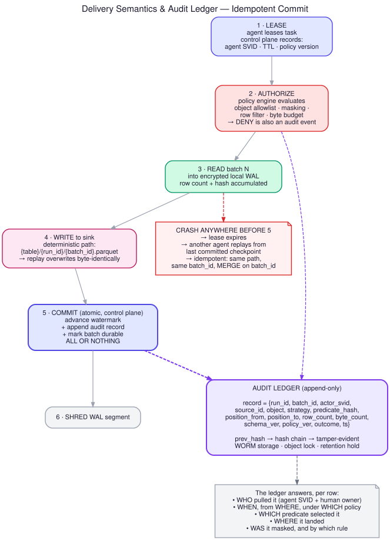

# Audit and Observability



Requirement: *"The connectors should be auditable. All the operations and transactions should
be traceable with logs."*

The bar for "auditable" in an enterprise data-sharing context is specific. For **any row in
your sink**, you must be able to answer, months later, without access to the source:

1. Who pulled it — agent identity *and* the accountable human
2. When, from which source, under which policy version
3. Which predicate selected it, and what the resume position was
4. Where it landed, and whether it was masked, by which rule
5. Whether the record has been tampered with since

---

## 1. The audit ledger

Append-only, hash-chained, WORM-stored. Separate from application logs — logs are for
debugging and are allowed to be lossy; the ledger is a record of custody and is not.

```json
{
  "seq": 184402,
  "prev_hash": "sha256:9f2c...",
  "ts": "2026-07-20T09:14:22.113Z",
  "event": "EXTRACT_COMMIT",

  "tenant_id": "tnt_a91",
  "run_id": "run_01J...",
  "batch_id": "bat_01J...",

  "actor": {
    "agent_svid": "spiffe://id360/ns/agents/sa/agent-eu-3",
    "agent_version": "1.4.2",
    "owner_principal": "ramanarao.nagarajan@example.com"
  },

  "source": {
    "connection_id": "conn_7f3a",
    "kind": "postgres",
    "endpoint_fingerprint": "sha256:1a4e...",
    "object": "sales.orders"
  },

  "extraction": {
    "strategy": "cdc_logical",
    "predicate_hash": "sha256:c7d1...",
    "columns": ["order_id", "customer_id", "region", "order_total", "updated_at"],
    "masked_columns": [{"column": "email", "rule": "sha256", "policy_rule_id": "pr_18"}],
    "position_from": "lsn:0/1A2B3C00",
    "position_to":   "lsn:0/1A2F91D8"
  },

  "volume": {"row_count": 41208, "byte_count": 18443921, "query_seconds": 4.7},

  "destination": {
    "sink": "object_store",
    "uri": "s3://id360-tnt-a91/sales.orders/_run=run_01J.../bat_01J....parquet",
    "content_sha256": "sha256:44b0...",
    "dek_key_id": "arn:aws:kms:eu-west-1:...:key/abcd-1234"
  },

  "governance": {
    "policy_version": 12,
    "schema_version": 7,
    "classification": "confidential",
    "legal_basis": "contract:DPA-2026-014"
  },

  "outcome": "SUCCESS"
}
```

`hash = sha256(prev_hash || canonical_json(record))`. The chain head is published periodically
(hourly) to a separate trust anchor — a different account, a different cloud, or a timestamping
authority. That is what makes tampering *detectable* rather than merely *discouraged*: an
attacker who can rewrite the ledger cannot also rewrite the published heads.

### Events that must be recorded

| Event | Why it matters |
|---|---|
| `CONNECTION_CREATED` / `UPDATED` / `DELETED` | Scope changes are the highest-risk config change |
| `POLICY_CHANGED` | Diff of old → new, and who approved it |
| `SECRET_ACCESSED` | Which principal, which reference, which task — not the value |
| `TASK_LEASED` | Establishes custody |
| `POLICY_DENIED` | **A denial is as important as an approval.** Auditors ask what you refused to read. |
| `SCHEMA_DRIFT_DETECTED` | With the fingerprint diff |
| `EXTRACT_COMMIT` | The main record above |
| `EXTRACT_FAILED` | Sanitized reason + retry disposition |
| `BUDGET_BREACH` | What was exceeded, what action was taken |
| `WATERMARK_OVERRIDE` | A human moved a watermark backwards — requires a signed override token and a reason string |
| `SINK_DELETE` | Erasure requests, with the legal basis |
| `KEY_ROTATED` / `KEY_REVOKED` | Crypto-shred events |

### Storage and retention

S3 Object Lock in compliance mode (or Azure immutable blob policy) with a retention period
matching the longest applicable regulation — commonly 7 years. Compliance mode means *your own
root account cannot delete it*, which is exactly the property an auditor wants to hear about.
Partition by `tenant_id/date`. Query with any engine that reads Parquet; the ledger is written
in both JSON (for streaming/integrity) and Parquet (for analysis).

---

## 2. Traceability — one ID through everything

`run_id` is generated at scheduling and propagated as the OpenTelemetry trace ID. It appears in:

- Every log line the agent emits, on every component
- The audit ledger record
- The **source query itself**: `QUERY_TAG` (Snowflake), job label (BigQuery),
  `/* id360:run_01J... */` comment (Postgres/Oracle/SQL Server), `ClientRequestId` header
  (Graph), `quotaUser` (Google)

That last point is the one people skip and the one that pays off most. When the provider's DBA
sees a heavy query in `pg_stat_activity` at 3 a.m., the comment tells them it is yours and
gives them the exact ID to send you. When their FinOps team asks what a cost line is, the query
tag answers it. **Being identifiable in the provider's own telemetry is a feature, not a
liability.**

### Span structure

```
run (root)
├── resolve_strategy
├── authorize            → policy decision, allow/deny
├── mint_credential      → secret ref, TTL (never the value)
├── fetch_schema         → fingerprint, drift verdict
├── extract
│   ├── partition[0]     → rows, bytes, query_seconds, retries
│   ├── partition[1]
│   └── ...
├── encode               → arrow rows, parquet bytes, compression ratio
├── sink_write           → uri, content hash
└── commit               → watermark from → to
```

Sampling: 100% of errors, 100% of policy denials, 100% of budget breaches, and a low sample
rate for successful high-frequency runs. Never sample the audit ledger — that is not telemetry.

---

## 3. Metrics

**Per (tenant, connection, object):**

| Metric | Type | Alert on |
|---|---|---|
| `rows_extracted_total` | counter | Sudden 10× change either direction |
| `bytes_extracted_total` | counter | Approaching the contracted budget |
| `source_query_seconds_total` | counter | **This is the provider's bill** — trend it and report it |
| `api_calls_total{status}` | counter | 429 rate > 1% |
| `extract_duration_seconds` | histogram | p95 breaching SLO |
| `freshness_lag_seconds` | gauge | The headline SLI: source commit → sink visible |
| `watermark_position` | gauge | Not advancing = silent stall |
| `cdc_slot_lag_bytes` | gauge | **Page immediately.** This one can take down the provider's primary. |
| `schema_drift_events_total` | counter | Any |
| `dlq_records_total` | counter | Rate > 0.01% |
| `budget_utilization_ratio` | gauge | > 0.8 warn, ≥ 1.0 hard stop |
| `policy_denials_total` | counter | Spike = misconfiguration or probing |
| `zero_row_runs_ratio` | gauge | > 0.95 → you are over-scheduled; back off |

That last metric is a cost control disguised as an observability metric. If 95% of your runs
return nothing, you are paying the provider's API budget and your own compute for nothing.

### The four alerts that actually matter

1. **CDC slot / log lag above threshold** — can take down the provider's database. Page.
2. **Freshness lag beyond SLO** — the pipeline is silently broken.
3. **Budget utilization ≥ 100%** — you are about to become a cost incident.
4. **Sustained 429 rate** — you are degrading the provider's other applications.

Everything else is a ticket, not a page.

---

## 4. Reconciliation — proving completeness

Metrics prove the pipeline ran. Reconciliation proves it was *correct*. Run it on a schedule
(nightly for high-value objects, weekly otherwise) and record the result in the ledger.

| Level | Method | Cost | Catches |
|---|---|---|---|
| **Count** | `SELECT COUNT(*)` bounded by the same window, both sides | Very low | Gross loss/duplication |
| **Key set** | Pull PK column only (index-only scan), diff against sink keys | Low | Missing rows, **hard deletes** |
| **Checksum** | Aggregate hash per partition: `SUM(HASHTEXT(row))` or `BIT_XOR` | Medium | Value-level corruption |
| **Full row hash** | Compare `_id360_row_hash` sets | High | Everything; use on a sample or on incident |

A reconciliation mismatch is an audit event with an outcome of `RECONCILE_FAILED`, an
automatic ticket, and a defined remediation path (targeted re-extract of the divergent key
range, not a full reload).

---

## 5. Operator-facing surface

The control plane exposes, per tenant:

- **Lineage view** — object → strategy → runs → sink paths, with the audit record behind each.
- **Consumption report** — bytes, query-seconds, API calls, estimated $ by source. Shared with
  the *provider*, proactively. See [06-performance-and-cost-guardrails.md](06-performance-and-cost-guardrails.md).
- **Access report** — what the connector is currently authorized to read, versus the registered
  contract, with drift highlighted.
- **Ledger export** — signed, hash-verified bundle for a date range, for auditors.

The access report is worth building early. Being able to hand a provider's security team a
current, machine-generated statement of exactly what your connector can reach is what converts
a six-week security review into a one-week one.
