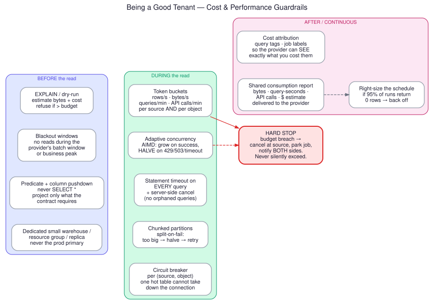

# Performance and Cost Guardrails — Being a Good Tenant



Requirement: *"It should not create a performance headache for the data provider. It should not
create a cost headache for the data provider."*

This is a design constraint, not an optimization. A connector that is merely *usually* polite
will eventually run a bad query during the provider's month-end close, and you will lose the
account. The guardrails below are enforced by the framework, not left to the connector author.

---

## 1. Before the read

### Estimate first, then decide

Never issue an unbounded read. Every extraction is priced before it runs:

| Engine | Estimation method |
|---|---|
| BigQuery | `dry_run` returns exact bytes billed — free, and there is no excuse for skipping it |
| Snowflake | `EXPLAIN` → estimated partitions/bytes; historical `QUERY_HISTORY` for the same predicate hash |
| Postgres/Oracle/SQL Server | `EXPLAIN` cost + estimated rows; check the plan uses the expected index |
| Lakehouse | Sum file sizes after partition/stat pruning — exact, before reading anything |
| Graph/Drive | Estimated item count from the delta page count |

If the estimate exceeds the task's budget, the framework **refuses to run** and raises a
`BUDGET_EXCEEDED` event with the estimate attached. Operator then splits, re-scopes, or gets an
explicit approval — an intentional decision, not an accidental bill.

### Verify the plan at onboarding

Run `EXPLAIN` on the incremental predicate during onboarding and **store the plan in the
connection registry**. If it does not use an index, you do not have an incremental strategy —
you have a full table scan wearing a costume. Say so, at onboarding, when it is cheap to fix.
Re-check the plan periodically; plans change when statistics change.

### Blackout windows

Per-source schedules that forbid extraction during the provider's ETL window, month-end close,
and business peak. Configured at onboarding, from the *provider's* calendar, not yours. A job
that would start in a blackout is deferred, not dropped, and the deferral is logged.

### Isolation at the source

| Source | Isolation mechanism |
|---|---|
| Snowflake | Dedicated XS warehouse, `AUTO_SUSPEND=60`, resource monitor with a hard credit quota |
| BigQuery | Dedicated project or reservation; `maximum_bytes_billed` set on every job |
| Redshift/Synapse | Dedicated WLM queue with concurrency + memory caps |
| Postgres/MySQL | Read replica; small dedicated connection pool; `statement_timeout` |
| Oracle | Resource Manager consumer group, low priority |
| SQL Server | Resource Governor workload group with a CPU/memory cap |
| Teradata | Low-priority TASM workload |
| Graph/Drive | Dedicated app registration so your throttling budget is separate from theirs |

That last row is underrated. Sharing an app registration with the provider's other integrations
means your retry storm becomes *their* outage.

### Project, do not scan

`SELECT *` is banned by the framework — the column list comes from the policy contract. On
BigQuery this is a direct, linear reduction in the bill. On columnar warehouses generally it
is the single largest lever available.

---

## 2. During the read

### Multi-dimensional token buckets

Budgets are enforced on four axes simultaneously, per source *and* per object:

```
rows/second · bytes/second · queries/minute · API calls/minute
```

Plus cumulative caps per window: `max_bytes_per_day`, `max_query_seconds_per_day`,
`max_api_calls_per_hour`. Cumulative caps are what stop a slow leak; rate caps are what stop a
spike. You need both.

### Adaptive concurrency (AIMD)

Additive increase, multiplicative decrease — the same control law as TCP congestion control,
for the same reason:

- Success → `concurrency += 1`, up to the configured ceiling
- `429` / `503` / timeout / lock wait → `concurrency = max(1, concurrency // 2)`, and pause for
  the full `Retry-After`

The system finds the source's actual capacity without being told, and it backs off *before* the
provider notices. Crucially, it treats the source's throttling signal as authoritative: never
override `Retry-After` with your own curve.

### Timeouts and cancellation

Every query carries a statement timeout. When the client-side deadline fires, the framework
**cancels server-side** — `pg_cancel_backend`, `SYSTEM$CANCEL_QUERY`, `KILL QUERY`,
`jobs.cancel`. Dropping the connection is not enough; many engines keep executing an orphaned
query, and now the provider is paying for compute that nobody will ever read.

### Split-on-fail

A partition that times out or exceeds its byte budget is halved and retried, recursively, down
to a floor. Large tables self-tune to a working chunk size without an operator picking
magic numbers.

### Circuit breakers, per object

Scoped to `(source, object)` — not per source. One pathological table opens its own breaker
while the other forty objects on the same connection keep flowing. Half-open probe after a
cooldown, single request, close on success.

### Read the cheap thing

Restating the strategy hierarchy as a cost rule, because it is where the money is:

| Instead of | Do | Provider saving |
|---|---|---|
| JDBC cursor over a warehouse | `COPY INTO` / `EXPORT DATA` / `UNLOAD` to a stage | ~10× compute |
| `SELECT` on a lakehouse table | Read Parquet via the manifest | 100% of compute |
| Full LIST on a lake bucket | Event notifications or inventory reports | ~10× request cost |
| `SELECT COUNT(*)` for freshness checks | Table metadata / statistics | ~100% |
| Full refresh nightly | Incremental + weekly key-set diff | Proportional to change rate |
| Re-fetching an unchanged document | Compare ETag/hash before fetching content | Proportional to churn |

---

## 3. After — and continuously

### Cost attribution, made visible

Every query is tagged with the run ID and the tenant. The provider can filter their own billing
telemetry to "what did ID360 cost me". Do not make them reverse-engineer it.

### Share the consumption report

Generate, on a schedule, and send to the **provider**:

```
ID360 consumption — sales.orders — week ending 2026-07-19
  extractions:      168 runs (24/day)
  rows:             4.1 M
  bytes read:       92 GB
  query-seconds:    412 s        (Snowflake XS ≈ 0.11 credits ≈ $0.25)
  API calls:        0
  throttle events:  0
  peak concurrency: 4
  blackout compliance: 100%
```

Two reasons this matters more than it looks. First, it makes the cost conversation factual
instead of anxious — most provider concern about connectors is about the *unknown*, not the
actual number. Second, it creates the pressure on *you* to keep the number small, because
someone is reading it.

### Right-size the schedule

Track `zero_row_runs_ratio`. If 95% of runs return nothing, the schedule is wrong. The
framework recommends a backoff, and can apply it automatically under a policy flag. Polling a
quiet table every five minutes is a pure cost transfer from you to the provider.

### Hard stop on breach

Budget exceeded → cancel at the source → park the job → notify **both** sides. The framework
never silently exceeds a budget and never quietly retries past it. Resuming requires an
explicit operator action, which is recorded in the audit ledger.

---

## 4. Performance on your side

The provider-facing rules above are about restraint. Your own pipeline still has to be fast.

- **Arrow end to end.** Source → Arrow RecordBatch → Parquet. Avoid Python dicts and pandas
  round-trips in the hot path; they cost 5–10× in both CPU and memory.
- **Bounded memory.** Stream batches; never accumulate a full result set. Backpressure the
  reader when the sink is slow — do not buffer your way into an OOM.
- **Target file size 128–512 MB** in the sink. Small files are the most common self-inflicted
  performance problem in a lakehouse, and they compound: every downstream query pays.
- **Parallelism at the partition level**, not the row level. Partitions are independently
  retryable, which makes them the natural unit of both concurrency and recovery.
- **Compression:** ZSTD level 3 or Snappy. ZSTD gives noticeably better ratios at similar
  speed for most tabular data; Snappy if downstream readers are latency-sensitive.
- **Sort within files** on the most common filter column so downstream min/max pruning works.
- **Compact on a schedule** if your ingest cadence produces small files — but compact in your
  sink, on your compute, never the provider's.

---

## 5. Capacity planning heuristics

Rough sizing for an agent, to set expectations at design time:

| Source type | Realistic throughput per agent core |
|---|---|
| Parquet from object store | 100–400 MB/s (network-bound) |
| Warehouse bulk unload + read | 50–200 MB/s (network-bound) |
| JDBC row cursor | 2–20 MB/s (**note the order of magnitude — this is why 5b exists**) |
| CDC log stream | 5k–50k events/s |
| Graph/Drive file fetch | 5–50 files/s (API-bound, not CPU-bound) |
| Mailbox message fetch | 10–100 msg/s (API-bound) |

Agents scale horizontally: partition the work, add agents. The control plane is not in the data
path, so it does not scale with volume — only with job count.
